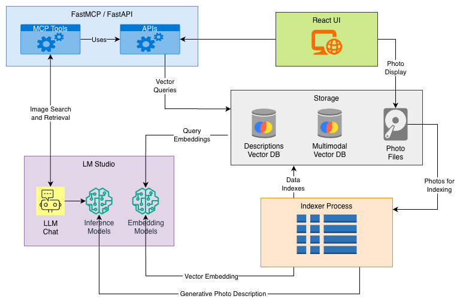

# An AI Powered Image Catalog

This project was started as an experiment and learning opportunity. As a photographer I have thousands of photos 
I've taken over the years. I wanted to build a searchable Image Catalog.  As a developer I wanted to work with 
AI running locally and see how far I can push it to accomplish these goals. It was inspired by some experiments
I had already done using local AI to generate text descriptions of photos to be used as `alt-text` on social media sites.

## Goals
### Technical Goals
* Local AI First Approach
  * Use Local AI models for coding assistance and learning
  * Implement a solution that uses only Local AI models
* Explore "Vision Enabled" models.  A perfect match for photography
* Lean into Open Standards
  * Use Open AI API and MCP in the solution making it easy to switch to other AI providers including cloud based ones

### Functional Goals
* Consume photos from a given folder (sub-folder)
* Generate rich descriptions of the photos 
* Search photos based on their description text
* Search photos based on similarity to another photo
* **Stretch Goal:** Integrate search capabilities into LLM chat.
  
## Architecture
There are 3 main executables in this solution:
1. Frontend
   * Written in `Typescript`
   * Uses `React` with the `Mantine` component library
2. The Indexer 
   * Processes photos deriving text descriptions using a Vision Enabled LLM
   * Stores `Descriptions` as searchable text in a [Chroma](https://www.trychroma.com/) Vector DB
   * Also stores Image Embeddings in a Multimodal [Chroma](https://www.trychroma.com/) Vector DB
3. The Server
   * Support for both REST APIs and MCP
   * MCP: (FastMCP)[https://gofastmcp.com/]
   * REST API: (FastAPI)[https://fastapi.tiangolo.com/]

